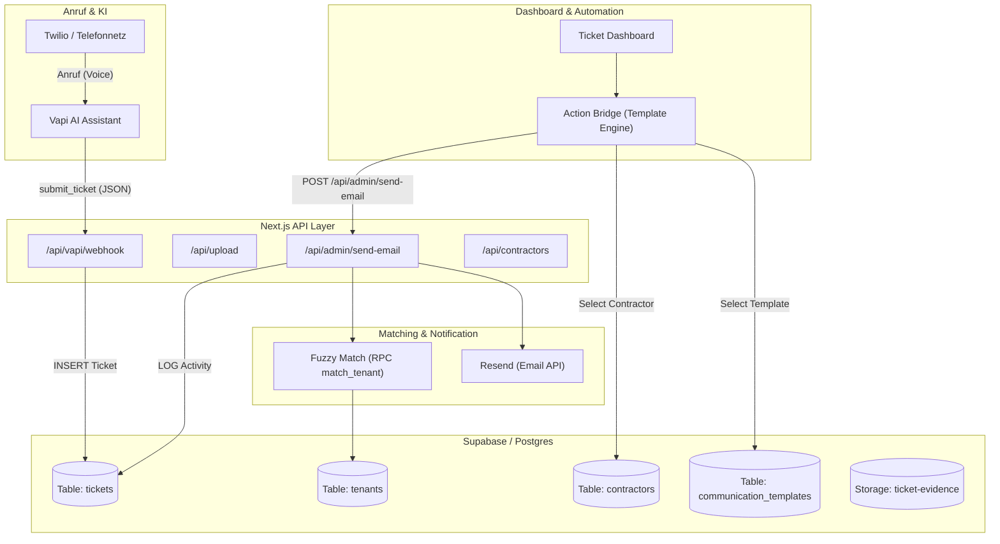

# Callfolio Architecture & Database

## System Data Flow


## Supabase SQL Schema
```sql
-- Main tickets table
CREATE TABLE IF NOT EXISTS tickets (
  id UUID DEFAULT uuid_generate_v4() PRIMARY KEY,
  organization_id UUID REFERENCES organizations(id) ON DELETE CASCADE,
  created_at TIMESTAMP WITH TIME ZONE DEFAULT NOW(),
  
  -- Identification & Classification
  call_id TEXT UNIQUE NOT NULL,
  ticket_id TEXT, -- Human-readable ID
  status ticket_status DEFAULT 'NEW',
  urgency ticket_urgency NOT NULL,
  
  -- Matching & Relations
  matched_tenant_id UUID REFERENCES tenants(id),
  contractor_id UUID REFERENCES contractors(id) ON DELETE SET NULL,
  
  -- Issue Details
  issue_summary TEXT,
  issue_details TEXT,
  is_archived BOOLEAN DEFAULT false
);

-- Contractors
CREATE TABLE IF NOT EXISTS contractors (
    id UUID PRIMARY KEY DEFAULT gen_random_uuid(),
    organization_id UUID NOT NULL REFERENCES organizations(id) ON DELETE CASCADE,
    name TEXT NOT NULL,
    email TEXT NOT NULL,
    phone TEXT DEFAULT '',
    trade TEXT NOT NULL
);

-- Communication Templates
CREATE TABLE IF NOT EXISTS communication_templates (
    id UUID PRIMARY KEY DEFAULT gen_random_uuid(),
    organization_id UUID NOT NULL REFERENCES organizations(id) ON DELETE CASCADE,
    slug TEXT NOT NULL,            -- e.g. 'tenant_confirmation'
    label TEXT NOT NULL,           -- UI display name
    subject TEXT DEFAULT '',
    content TEXT NOT NULL,         -- Template body with {{variable}} placeholders
    UNIQUE(organization_id, slug)
);
```

## Critical Routines
- **3-Tier Matcher (`lib/fuzzy-match.ts`)**: Phone Exact (1.0) -> Fuzzy Text (≥0.7) -> Manual Review (≥0.4). Uses Postgres RPC `match_tenant`.
- **Vapi Webhook (`/api/vapi/webhook/route.ts`)**: Async ingestion. Maps `urgency` or `priority` dynamically. Logs all actions to `ticket_activities`.
